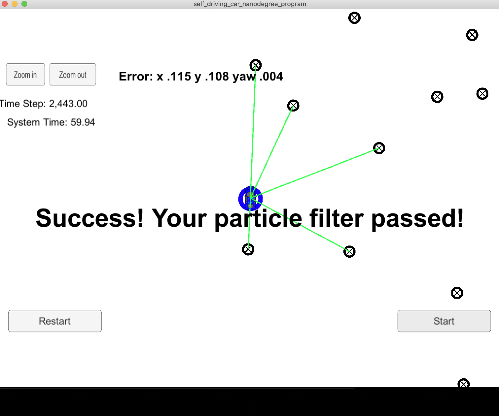

# Writeup

## Accuracy
**CRITERIA: Does your particle filter localize the vehicle to within the desired accuracy?**

The screenshot below shows that the particle filter is able to localize the vehicle with the desired accuracy.
 
 

A video showing the entire simulation is here: [output/success-720p.mov](output/success-720p.mov)

## Performance
 
**CRITERIA: Does your particle filter run within the specified time of 100 seconds?**
 
 The particle filter finishes in 60 secs.

## General
 
**CRITERIA: Does your code use a particle filter to localize the robot?** 

The particle filter is implemented as taught in the lessons.

[L33-L62 : ](https://github.com/arrawatia/CarND-Kidnapped-Vehicle-Project/blob/master/src/particle_filter.cpp#L33-L62)The particles are initialized from a Gaussian distribution centered around the GPS measurements. 

[L76-L112 : ](https://github.com/arrawatia/CarND-Kidnapped-Vehicle-Project/blob/master/src/particle_filter.cpp#L76-L112) The position of particles at the next timestep is predicted using the bicycle motion model.

[L126-L155 : ](https://github.com/arrawatia/CarND-Kidnapped-Vehicle-Project/blob/master/src/particle_filter.cpp#L126-L155) The predicted measurements are associated with the nearest landmark using the **Nearest Neighbor Algorithm**.

[L176-L240 : ](https://github.com/arrawatia/CarND-Kidnapped-Vehicle-Project/blob/master/src/particle_filter.cpp#L176-L240) The importance weights for all particles are computed using the algorithm discussed in the class. The first step is to convert the observations to map coordinates, then they are associated with the closest landmarks. The weights are calculated using the multivariate Gaussian distribution.

 [L251-L283 : ](https://github.com/arrawatia/CarND-Kidnapped-Vehicle-Project/blob/master/src/particle_filter.cpp#L251-L283) The next batch of particles are sampled from the current set of particles. The sampling algorithm selects the particles based on their weights. We use the **Resampling wheel algorithm** for this task.